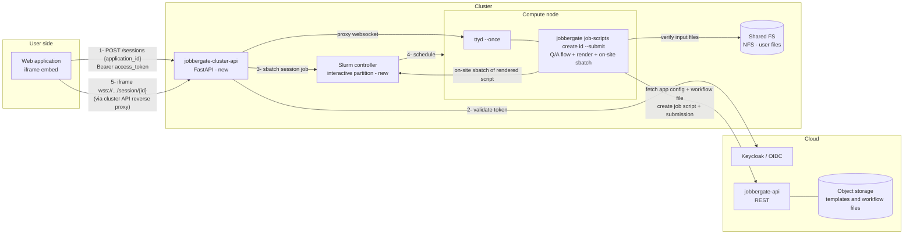
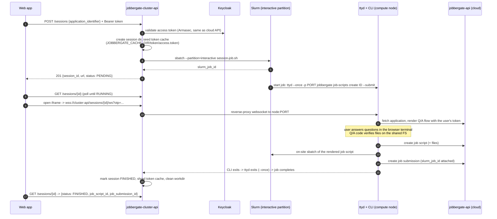

# Jobbergate Cluster API

> **Status: PoC implemented** — wired into `jobbergate-composed`; endpoint tunneling to
> the cloud API is planned but out of scope for this iteration. See
> [Implementation notes](#implementation-notes) for what exists today.

A small REST API deployed **on each cluster** that runs Jobbergate's interactive
question/answer application flows **on the cluster side** instead of on the user's machine.

## Problem

Jobbergate applications ship a workflow source file (`jobbergate.py`) whose question/answer flow
gathers the rendering variables for the Jinja job-script templates. Today this flow runs **on the
client side** (`jobbergate job-scripts create <id>` inside `jobbergate-cli`), which means:

- The Q/A code cannot verify anything that only exists on the cluster (input files, datasets,
  module availability, project directories, quotas).
- On-site submission (`sbatch` directly on a login node) requires the user to have a shell on the
  cluster and a configured CLI.
- Our web application has no way to offer the interactive flow at all — it only works in a
  terminal.

## Proposal in one paragraph

Add a new sub-project, **`jobbergate-cluster-api`**: a FastAPI service running on each cluster
(next to `jobbergate-agent`). It exposes an endpoint that receives an *application id or
identifier* plus the user's OIDC access token, then launches — via `sbatch`/`srun` into a
dedicated shared partition — a short-lived interactive job that runs the equivalent of
`jobbergate job-scripts create <id-or-identifier> --submit` and serves that terminal over the web
with [`ttyd`](https://github.com/tsl0922/ttyd). The web application embeds the returned session
URL in an iframe. Because the CLI now runs **on a compute node**, the Q/A flow can inspect the
filesystem, validate inputs, and submit the resulting job script right away in on-site mode.

## System design

### Components

| Component | Role |
|---|---|
| `jobbergate-cluster-api` (new) | Per-cluster FastAPI service. Validates user tokens, creates interactive sessions, tracks their lifecycle, proxies/hands out session URLs. |
| Session job (new) | A Slurm job in the `interactive` partition wrapping `ttyd → jobbergate job-scripts create`. One per session, one ttyd connection (`--once`). |
| `interactive` partition (new) | Dedicated shared partition (`OverSubscribe=FORCE`, small default resources, short `MaxTime`, elevated `PriorityTier`) so sessions start immediately and never queue behind batch work. |
| `jobbergate-cli` / `jobbergate-core` (existing) | Unchanged execution engine: `ApplicationRuntime`, `JobbergateAuthHandler` (token cache), `OnsiteJobSubmission` (`sbatch` via `SBATCH_PATH`). |
| Cloud `jobbergate-api` (existing) | Remains the source of truth for applications, job scripts, and submissions. The session's CLI talks to it exactly as a user-run CLI would. |
| Web application (existing) | Calls the cluster API to open a session, embeds the ttyd URL in an iframe. |

### Architecture



### Session lifecycle



### REST surface (v0)

| Method | Path | Description |
|---|---|---|
| `POST` | `/jobbergate/sessions` | Body: `{application_id \| application_identifier, sbatch_params?}`. Requires `Authorization: Bearer <user access token>`. Creates the session, submits the session job, returns `{session_id, url, otp, status}`. |
| `GET` | `/jobbergate/sessions/{id}` | Session status: `PENDING → RUNNING → FINISHED \| FAILED \| EXPIRED`, plus `job_script_id` / `job_submission_id` once the CLI reports them. |
| `DELETE` | `/jobbergate/sessions/{id}` | Cancel: `scancel` the session job, clean up. |
| `GET/WS` | `/jobbergate/sessions/{id}/ws` | Reverse proxy to the ttyd instance on the compute node. Guarded by a one-time password minted at session creation (see security). |
| `GET` | `/jobbergate/health` | Liveness/readiness (mirrors agent's health report style). |

The session job's node/port are discovered by the API from `squeue`/`scontrol show job` plus a
port file the job writes into the session workdir — the web app never talks to a compute node
directly.

### Authentication flow

The key trick: `jobbergate-cli` already loads tokens from a cache directory
(`JobbergateAuthHandler` reads `JOBBERGATE_CACHE_DIR/token/access.token` and `refresh.token`,
falling back to a login flow only when both are missing/expired). So the CLI on the compute node
is authenticated **as the user** without any interactive login:

1. The web app forwards the user's existing **access token** (and, when available, the refresh
   token) in the `POST /sessions` call.
2. The cluster API validates the access token against Keycloak (same Armasec permission model as
   the cloud API — new scopes `jobbergate:sessions:{view,edit}`).
3. It writes the token(s) into a **per-session, mode-0700, tmpfs-backed** cache directory and
   points the session job at it via `JOBBERGATE_CACHE_DIR`.
4. The CLI inside ttyd picks the tokens up transparently; every request it makes to the cloud API
   is attributed to the real user (audit trail preserved: `owner_email` on job scripts and
   submissions stays correct).
5. On session end (or TTL), the cache directory is shredded. Session TTL ≤ access-token lifetime
   unless a refresh token was provided.

ttyd itself is never exposed raw: it binds to `127.0.0.1`/the job's node interface, and the only
route in is the cluster API's websocket proxy, which requires the session's **one-time password**
(returned once at creation) — so a leaked iframe URL without the OTP is useless, and `--once`
means a second connection attempt is rejected anyway.

### User identity on the cluster

For the PoC the session job runs as the service user (like `jobbergate-agent` submitting via
`X-SLURM-USER` today, `local-user` in composed). The design leaves a seam for production: reuse
the agent's **user-mapper** (e.g. LDAP email → username) so the session job is submitted with
`sbatch --uid`/`sudo -u <mapped-user>` and the Q/A flow sees the user's real files and quotas.
This is a deployment concern, not an API change.

### The `interactive` partition

Interactive sessions must start in seconds, not queue for hours:

```
PartitionName=interactive Nodes=c1,c2 OverSubscribe=FORCE:4 MaxTime=00:30:00 \
    DefMemPerCPU=256 PriorityTier=10 State=UP
```

- `OverSubscribe=FORCE` — sessions are I/O-bound shells; pack many per core so they are all shared.
- Short `MaxTime` — a hard backstop for abandoned sessions (ttyd `--once` + CLI exit is the normal
  cleanup path; Slurm kills stragglers).
- `PriorityTier` above the batch partitions — never stuck behind real work.
- The **rendered job script** submitted by the Q/A flow goes to the normal batch partitions; only
  the session shell lives here.

### Session job sketch

```bash
#!/bin/bash
#SBATCH --partition=interactive
#SBATCH --job-name=jg-session-{session_id}
#SBATCH --output={session_dir}/session.log

export JOBBERGATE_CACHE_DIR={session_dir}/cache      # seeded token cache
export SBATCH_PATH=/usr/bin/sbatch                    # on-site submission mode

PORT=$(python -c 'import socket; s=socket.socket(); s.bind(("",0)); print(s.getsockname()[1])')
echo "$SLURMD_NODENAME:$PORT" > {session_dir}/endpoint

exec ttyd --once --writable --port "$PORT" \
    jobbergate job-scripts create {id_or_identifier} --fast-fallback-off --submit \
        --cluster-name {cluster_name} --download
```

(`srun` is the fallback for clusters where we prefer an allocation-attached step; `sbatch` keeps
the API stateless across restarts since Slurm owns the process.)

### PoC on jobbergate-composed

New service in `jobbergate-composed/docker-compose.yml`:

- **`jobbergate-cluster-api`** — built on the `slurm-docker-cluster` image (so `sbatch`,
  `squeue`, munge, and `slurm.conf` are present, same as `c1`/`c2`), plus Python/uv, `ttyd`,
  `jobbergate-cli`. Joins the cluster as a submit host; mounts the shared `/nfs` volume and the
  munge key volume; exposes port `8003` to the host for the web app / manual browser testing.
- **Slurm config** — add the `interactive` partition to the composed `slurm.conf` over `c1,c2`.
- **Keycloak** — add `jobbergate:sessions:view` / `jobbergate:sessions:edit` roles to the
  existing realm export, attached to the CLI client's user.
- Smoke test: `curl -X POST :8003/jobbergate/sessions -H "Authorization: Bearer $(jobbergate
  show-token --plain)" -d '{"application_identifier": "simple-application"}'`, open the returned
  URL in a browser, answer the questions, watch the submission land in `squeue`.

### Future work (explicitly out of scope now)

- **Tunneling** the cluster API endpoints through the cloud API (no inbound ports on clusters);
  the REST surface is designed so only the base URL changes.
- Production **user mapping** (`sudo -u` / `sbatch --uid`) via the agent's user-mapper plugins.
- Session **multiplexing/reconnect** (drop `--once` in favor of authenticated re-attach).
- **Non-interactive** fast path: `POST /sessions` with `param_dict` runs the flow headless
  (`ApplicationRuntime` already supports supplied params) and returns ids without a terminal.

## Implementation notes

What is implemented in this sub-project (a uv workspace member, tested with
`uv run --package jobbergate-cluster-api --group dev pytest jobbergate-cluster-api/tests`):

| Module | Purpose |
|---|---|
| `jobbergate_cluster_api/config.py` | `CLUSTER_API_*` settings (Armasec domain, sessions dir/partition, submit user, CLI passthrough env). |
| `jobbergate_cluster_api/security.py` | Armasec guard; sessions are locked down with the existing `jobbergate:job-scripts:edit` permission, so **no new realm roles are needed**. |
| `jobbergate_cluster_api/sessions.py` | Session dir + token-cache seeding, session job script rendering, `meta.json` persistence (API restart-safe), status derivation, credential shredding. |
| `jobbergate_cluster_api/slurm.py` | `sbatch --parsable` / `scontrol show job` / `scancel` wrappers, run as `SUBMIT_USER` via `gosu`. |
| `jobbergate_cluster_api/proxy.py` | HTTP + websocket reverse proxy to the per-session ttyd (subprotocol `tty`). |
| `jobbergate_cluster_api/main.py` | The routes from [REST surface](#rest-surface-v0), OTP-to-cookie exchange for the terminal iframe. |

Composed wiring (`jobbergate-composed/`):

- `Dockerfile-slurm` installs **ttyd** and **uv** into `slurm-base` — the image shared by `c1`,
  `c2`, `slurmctld`, and the agent — so every node of the `interactive` partition can run
  session jobs.
- `etc/slurm.conf` adds the `interactive` partition (`OverSubscribe=FORCE:4`, `MaxTime=00:30:00`,
  `Priority=100`, nodes `c[1-2]`).
- `etc/slurm-entrypoint.sh` gains a `jobbergate-cluster-api` branch (munge + wait for slurmctld +
  `uv run ... uvicorn`).
- `docker-compose.yml` gains the `jobbergate-cluster-api` service on host port **8003**, sharing
  the munge key, `/nfs`, and the workspace mount with the cluster containers.

Smoke test:

```bash
# from jobbergate-composed:
docker compose up --build -d jobbergate-cluster-api c1 c2
# grab a user token via the CLI container (device flow), then:
curl -s -X POST http://localhost:8003/jobbergate/sessions \
    -H "Authorization: Bearer $ACCESS_TOKEN" -H "Content-Type: application/json" \
    -d '{"application_identifier": "simple-application"}'
# poll GET /jobbergate/sessions/{id} until RUNNING, then open in a browser:
#   http://localhost:8003/jobbergate/sessions/{id}/terminal/?otp={otp}
```

Not yet implemented (tracked in [Future work](#future-work-explicitly-out-of-scope-now)):
result-id reporting (`job_script_id`/`job_submission_id` stay `null`; the `exit_code` file is the
completion signal), reconnectable sessions, tunneling, and real user mapping.

## Design rationale / trade-offs

- **Why reuse the CLI instead of a new runtime?** `jobbergate job-scripts create --submit`
  already implements Q/A (`ApplicationRuntime`), rendering, upload, and on-site `sbatch`
  (`OnsiteJobSubmission` + `SBATCH_PATH`). Wrapping it in ttyd gives us the full feature set —
  including SME-authored `jobbergate.py` flows unchanged — for the cost of a session manager.
- **Why a Slurm job instead of running ttyd inside the API container?** The Q/A flow must see the
  cluster exactly as the user's job will (filesystems, modules, node environment), and Slurm
  gives us accounting, cgroup limits, and cleanup for free.
- **Why token-cache seeding instead of a device-code login in the terminal?** Zero extra clicks —
  the user is already authenticated in the web app; the forwarded token keeps API-side ownership
  and audit intact. The device-code flow remains the fallback if the seeded token is expired.
