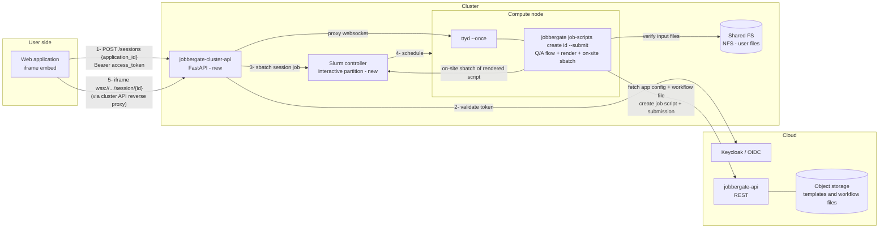
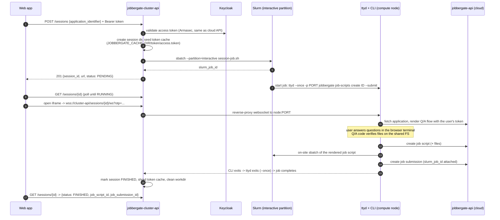

# Jobbergate Cluster API

> **Status: PoC implemented** — wired into `jobbergate-composed`; endpoint tunneling to
> the cloud API is planned but out of scope for this iteration. See
> [Implementation notes](#implementation-notes) for what exists today.

A small REST API deployed **on each cluster** that runs Jobbergate's interactive
question/answer application flows **on the cluster side** instead of on the user's machine.

## Problem

Jobbergate applications ship a workflow source file (`jobbergate.py`) whose question/answer flow
gathers the rendering variables for the Jinja job-script templates. Today this flow runs **on the
client side** (`jobbergate job-scripts create <id>` inside `jobbergate-cli`), which means:

- The Q/A code cannot verify anything that only exists on the cluster (input files, datasets,
  module availability, project directories, quotas).
- On-site submission (`sbatch` directly on a login node) requires the user to have a shell on the
  cluster and a configured CLI.
- Our web application has no way to offer the interactive flow at all — it only works in a
  terminal.

## Proposal in one paragraph

Add a new sub-project, **`jobbergate-cluster-api`**: a FastAPI service running on each cluster
(next to `jobbergate-agent`). It exposes an endpoint that receives an *application id or
identifier* plus the user's OIDC access token, then launches — via `sbatch`/`srun` into a
dedicated shared partition — a short-lived interactive job that runs the equivalent of
`jobbergate job-scripts create <id-or-identifier> --submit` and serves that terminal over the web
with [`ttyd`](https://github.com/tsl0922/ttyd). The web application embeds the returned session
URL in an iframe. Because the CLI now runs **on a compute node**, the Q/A flow can inspect the
filesystem, validate inputs, and submit the resulting job script right away in on-site mode.

## System design

### Components

| Component | Role |
|---|---|
| `jobbergate-cluster-api` (new) | Per-cluster FastAPI service. Validates user tokens, creates interactive sessions, tracks their lifecycle, proxies/hands out session URLs. |
| Session job (new) | A Slurm job in the `interactive` partition wrapping `ttyd → jobbergate job-scripts create`. One per session, one ttyd connection (`--once`). |
| `interactive` partition (new) | Dedicated shared partition (`OverSubscribe=FORCE`, small default resources, short `MaxTime`, elevated `PriorityTier`) so sessions start immediately and never queue behind batch work. |
| `jobbergate-cli` / `jobbergate-core` (existing) | Unchanged execution engine: `ApplicationRuntime`, `JobbergateAuthHandler` (token cache), `OnsiteJobSubmission` (`sbatch` via `SBATCH_PATH`). |
| Cloud `jobbergate-api` (existing) | Remains the source of truth for applications, job scripts, and submissions. The session's CLI talks to it exactly as a user-run CLI would. |
| Web application (existing) | Calls the cluster API to open a session, embeds the ttyd URL in an iframe. |

### Architecture



### Session lifecycle



### REST surface (v0)

| Method | Path | Description |
|---|---|---|
| `POST` | `/jobbergate/sessions` | Body: `{application_id \| application_identifier, sbatch_params?}`. Requires `Authorization: Bearer <user access token>`. Creates the session, submits the session job, returns `{session_id, url, otp, status}`. |
| `GET` | `/jobbergate/sessions/{id}` | Session status: `PENDING → RUNNING → FINISHED \| FAILED \| EXPIRED`, plus `job_script_id` / `job_submission_id` once the CLI reports them. |
| `DELETE` | `/jobbergate/sessions/{id}` | Cancel: `scancel` the session job, clean up. |
| `GET/WS` | `/jobbergate/sessions/{id}/ws` | Reverse proxy to the ttyd instance on the compute node. Guarded by a one-time password minted at session creation (see security). |
| `GET` | `/jobbergate/health` | Liveness/readiness (mirrors agent's health report style). |

The session job's node/port are discovered by the API from `squeue`/`scontrol show job` plus a
port file the job writes into the session workdir — the web app never talks to a compute node
directly.

### Authentication flow

The key trick: `jobbergate-cli` already loads tokens from a cache directory
(`JobbergateAuthHandler` reads `JOBBERGATE_CACHE_DIR/token/access.token` and `refresh.token`,
falling back to a login flow only when both are missing/expired). So the CLI on the compute node
is authenticated **as the user** without any interactive login:

1. The web app forwards the user's existing **access token** (and, when available, the refresh
   token) in the `POST /sessions` call.
2. The cluster API validates the access token against Keycloak (same Armasec permission model as
   the cloud API): the guard mirrors the job-script creation route, `jobbergate:admin` OR `jobbergate:job-scripts:create`.
3. It writes the token(s) into a **per-session, mode-0700, tmpfs-backed** cache directory and
   points the session job at it via `JOBBERGATE_CACHE_DIR`.
4. The CLI inside ttyd picks the tokens up transparently; every request it makes to the cloud API
   is attributed to the real user (audit trail preserved: `owner_email` on job scripts and
   submissions stays correct).
5. On session end (or TTL), the cache directory is shredded. Session TTL ≤ access-token lifetime
   unless a refresh token was provided.

ttyd itself is never exposed raw: it binds to `127.0.0.1`/the job's node interface, and the only
route in is the cluster API's websocket proxy, which requires the session's **one-time password**
(returned once at creation) — so a leaked iframe URL without the OTP is useless, and `--once`
means a second connection attempt is rejected anyway.

### User identity on the cluster

For the PoC the session job runs as the service user (like `jobbergate-agent` submitting via
`X-SLURM-USER` today, `local-user` in composed). The design leaves a seam for production: reuse
the agent's **user-mapper** (e.g. LDAP email → username) so the session job is submitted with
`sbatch --uid`/`sudo -u <mapped-user>` and the Q/A flow sees the user's real files and quotas.
This is a deployment concern, not an API change.

### The `interactive` partition

Interactive sessions must start in seconds, not queue for hours:

```
PartitionName=interactive Nodes=c1,c2 OverSubscribe=FORCE:4 MaxTime=00:30:00 \
    DefMemPerCPU=256 PriorityTier=10 State=UP
```

- `OverSubscribe=FORCE` — sessions are I/O-bound shells; pack many per core so they are all shared.
- Short `MaxTime` — a hard backstop for abandoned sessions (ttyd `--once` + CLI exit is the normal
  cleanup path; Slurm kills stragglers).
- `PriorityTier` above the batch partitions — never stuck behind real work.
- The **rendered job script** submitted by the Q/A flow goes to the normal batch partitions; only
  the session shell lives here.

### Session job sketch

```bash
#!/bin/bash
#SBATCH --partition=interactive
#SBATCH --job-name=jg-session-{session_id}
#SBATCH --output={session_dir}/session.log

export JOBBERGATE_CACHE_DIR={session_dir}/cache      # seeded token cache
export SBATCH_PATH=/usr/bin/sbatch                    # on-site submission mode

PORT=$(python -c 'import socket; s=socket.socket(); s.bind(("",0)); print(s.getsockname()[1])')
echo "$SLURMD_NODENAME:$PORT" > {session_dir}/endpoint

exec ttyd --once --writable --port "$PORT" \
    jobbergate job-scripts create {id_or_identifier} --fast-fallback-off --submit \
        --cluster-name {cluster_name} --download
```

(`srun` is the fallback for clusters where we prefer an allocation-attached step; `sbatch` keeps
the API stateless across restarts since Slurm owns the process.)

### PoC on jobbergate-composed

New service in `jobbergate-composed/docker-compose.yml`:

- **`jobbergate-cluster-api`** — built on the `slurm-docker-cluster` image (so `sbatch`,
  `squeue`, munge, and `slurm.conf` are present, same as `c1`/`c2`), plus Python/uv, `ttyd`,
  `jobbergate-cli`. Joins the cluster as a submit host; mounts the shared `/nfs` volume and the
  munge key volume; exposes port `8003` to the host for the web app / manual browser testing.
- **Slurm config** — add the `interactive` partition to the composed `slurm.conf` over `c1,c2`.
- **Keycloak** — no realm changes: the session guard reuses the existing job-script
  creation permissions.
- Smoke test: `curl -X POST :8003/jobbergate/sessions -H "Authorization: Bearer $(jobbergate
  show-token --plain)" -d '{"application_identifier": "simple-application"}'`, open the returned
  URL in a browser, answer the questions, watch the submission land in `squeue`.

### Future work (explicitly out of scope now)

- **Tunneling** the cluster API endpoints through the cloud API (no inbound ports on clusters);
  the REST surface is designed so only the base URL changes.
- Production **user mapping** (`sudo -u` / `sbatch --uid`) via the agent's user-mapper plugins.
- Session **multiplexing/reconnect** (drop `--once` in favor of authenticated re-attach).
- **Non-interactive** fast path: `POST /sessions` with `param_dict` runs the flow headless
  (`ApplicationRuntime` already supports supplied params) and returns ids without a terminal.

## Implementation notes

What is implemented in this sub-project (a uv workspace member, tested with
`uv run --package jobbergate-cluster-api --group dev pytest jobbergate-cluster-api/tests`):

| Module | Purpose |
|---|---|
| `jobbergate_cluster_api/config.py` | `CLUSTER_API_*` settings (Armasec domain, sessions dir/partition, submit user, CLI passthrough env). |
| `jobbergate_cluster_api/security.py` | Armasec guard; sessions are locked down with the cloud API's own job-script creation permissions (`jobbergate:admin` OR `jobbergate:job-scripts:create`), so **no new realm roles are needed**. |
| `jobbergate_cluster_api/sessions.py` | Session dir + token-cache seeding, session job script rendering, `meta.json` persistence (API restart-safe), status derivation, credential shredding. |
| `jobbergate_cluster_api/slurm.py` | `sbatch --parsable` / `scontrol show job` / `scancel` wrappers, run as `SUBMIT_USER` via `gosu`. |
| `jobbergate_cluster_api/proxy.py` | HTTP + websocket reverse proxy to the per-session ttyd (subprotocol `tty`). |
| `jobbergate_cluster_api/main.py` | The routes from [REST surface](#rest-surface-v0), OTP-to-cookie exchange for the terminal iframe. |

Composed wiring (`jobbergate-composed/`):

- `Dockerfile-slurm` installs **ttyd** and **uv** into `slurm-base` — the image shared by `c1`,
  `c2`, `slurmctld`, and the agent — so every node of the `interactive` partition can run
  session jobs.
- `etc/slurm.conf` adds the `interactive` partition (`OverSubscribe=FORCE:4`, `MaxTime=00:30:00`,
  `Priority=100`, nodes `c[1-2]`).
- `etc/slurm-entrypoint.sh` gains a `jobbergate-cluster-api` branch (munge + wait for slurmctld +
  `uv run ... uvicorn`).
- `docker-compose.yml` gains the `jobbergate-cluster-api` service on host port **8003**, sharing
  the munge key, `/nfs`, and the workspace mount with the cluster containers.

Smoke test:

```bash
# from jobbergate-composed:
docker compose up --build -d jobbergate-cluster-api c1 c2
# grab a user token via the CLI container (device flow), then:
curl -s -X POST http://localhost:8003/jobbergate/sessions \
    -H "Authorization: Bearer $ACCESS_TOKEN" -H "Content-Type: application/json" \
    -d '{"application_identifier": "simple-application"}'
# poll GET /jobbergate/sessions/{id} until RUNNING, then open in a browser:
#   http://localhost:8003/jobbergate/sessions/{id}/terminal/?otp={otp}
```

Not yet implemented (tracked in [Future work](#future-work-explicitly-out-of-scope-now)):
result-id reporting (`job_script_id`/`job_submission_id` stay `null`; the `exit_code` file is the
completion signal), reconnectable sessions, tunneling, and real user mapping.

## Self-guided demo

A complete walkthrough on your own machine, from zero to answering an application's
questions in a browser terminal while the flow runs on a Slurm compute node.

**0. Prerequisites.** Docker Desktop running, and the Keycloak alias in your hostfile
(`/etc/hosts` on Linux/macOS):

```
127.0.0.1   keycloak.local
```

**1. Bring up the stack** (first build takes a few minutes):

```bash
cd jobbergate-composed
docker compose up --build -d
```

Wait until `docker compose ps` shows `jobbergate-api` healthy and
`jobbergate-cluster-api` healthy, and the compute nodes are idle:

```bash
docker exec slurmctld sinfo
# interactive    up      30:00      2   idle c[1-2]   <- the sessions partition
```

**2. Log in and register the example application.** The composed stack ships a demo
user (`local-user` / password `local`) and mounts the example application at
`/simple-example` inside the CLI container:

```bash
docker compose run jobbergate-cli bash
# inside the container:
jobbergate login          # open the printed link, sign in as local-user / local
jobbergate applications create --name simple \
    --identifier simple-application --application-path /simple-example
```

**3. Launch a web session with one command** (still inside the CLI container):

```bash
jobbergate job-scripts create-web simple-application
```

`create-web` forwards your token to the cluster API, opens the session, waits until
the terminal is up (the first run pays a one-time `uv` environment build for the CLI
on the shared volume), and prints the terminal URL. The composed stack sets
`CLUSTER_API_URL=http://jobbergate-cluster-api:8000` (how the CLI reaches the API)
and `CLUSTER_API_PUBLIC_URL=http://localhost:8003` (what your browser can reach) —
so open the printed `http://localhost:8003/...` URL in your host browser. On a
workstation install the command opens the browser for you.

<details>
<summary>Alternative: drive the raw REST API with curl (what a web app would do)</summary>

Grab a token inside the CLI container with `jobbergate show-token --plain`, export
it on your host as `ACCESS_TOKEN`, then:

```bash
curl -s -X POST http://localhost:8003/jobbergate/sessions \
    -H "Authorization: Bearer $ACCESS_TOKEN" -H "Content-Type: application/json" \
    -d '{"application_identifier": "simple-application"}' | python3 -m json.tool
```

The response carries `session_id`, the terminal `url`, and the one-time password
`otp` — the OTP is only ever returned here. Poll
`GET /jobbergate/sessions/<session_id>` until `"status": "RUNNING"`, then open
`http://localhost:8003/jobbergate/sessions/<session_id>/terminal/?otp=<otp>`.

</details>

**4. Answer the questions in the browser.**
You are now inside `jobbergate job-scripts create simple-application --submit`
running **on a compute node**: answer the application's questions exactly as a
cluster user would in ssh. When the flow completes it renders the job script and
submits it on-site via `sbatch`, then the session closes itself (`ttyd --once`).

**5. Verify the outcome:**

```bash
docker exec slurmctld gosu local-user squeue          # or sacct once it finishes
docker compose run jobbergate-cli jobbergate job-submissions list   # attributed to local-user
curl -s http://localhost:8003/jobbergate/sessions/<session_id> \
    -H "Authorization: Bearer $ACCESS_TOKEN"           # "status": "FINISHED", "exit_code": 0
```

The seeded token cache is shredded as soon as the session reaches a terminal state.

**6. Clean up:**

```bash
docker compose down          # add -v to also drop volumes (fresh Keycloak/DB next time)
```

If something misbehaves, the session's full trace is in
`jobbergate-composed/slurm-fake-nfs/cluster-api-sessions/<session_id>/session.log`,
and `docker logs jobbergate-cluster-api` has the API side.

## Design deep-dive: why ttyd (and an unmodified jobbergate-cli)

The single most important constraint on this design: **SME-authored applications must
keep working exactly as they do today.** An application is arbitrary Python — a
`jobbergate.py` subclassing `JobbergateApplicationBase`, with `mainflow()`,
dynamically chained `nextworkflow` methods, and any `QuestionBase` subclass
(`Text`, `Integer`, `List`, `Checkbox`, `Confirm`, ...). Teams have years of these
in production.

Any approach that reimplements the Q/A layer breaks that contract:

| Alternative | Why it was rejected |
|---|---|
| Re-render questions as web forms (extract a JSON schema from the application, serve React forms) | The question flow is *imperative*, not declarative: `mainflow()` can compute the next question from previous answers, call out to the filesystem, or branch into `nextworkflow`. A schema extraction only covers the trivial subset — every non-trivial application would silently change behavior. It also forks the Q/A engine into two implementations that must be kept in sync forever. |
| A [Textual](https://textual.textualize.io/) TUI adapter (map `QuestionBase` subclasses onto Textual widgets; web-servable via `textual serve`) | The most tempting middle ground — richer UI than a raw terminal, still Python, natively servable on the web. Initial tests confirmed the same trap as the web-forms path, though: the adapter only covers the declared `QuestionBase` API, and applications are free to do anything the CLI allows *outside* it (direct `print`/Rich output, custom prompts, mid-flow filesystem interaction). Anything beyond `QuestionBase` subclasses that works on the CLI can just break the Textual adapter. It could return later as an *opt-in* frontend for well-behaved declarative applications — same slot as the `param_dict` web-forms path — but it cannot be the compatibility baseline. |
| A custom PTY-over-websocket bridge inside the API | Functionally the same as ttyd, but we own the terminal protocol, resize handling, flow control, and the xterm.js frontend. ttyd is exactly this, already hardened, in a single static ~1 MB binary. |
| SSH / wetty into a login node | Requires cluster shell accounts and credentials management for web users — the very thing Jobbergate exists to avoid — and lands the flow on a login node, not inside a Slurm-accounted job. |
| `srun --pty` attached from the API container | Ties the interactive session to a long-lived process inside the API (state, restarts, scaling all get harder). With `sbatch` + ttyd, Slurm owns the process and the API stays stateless. |

What running the **stock CLI under ttyd** buys us:

- **Full compatibility by construction.** The session runs literally
  `jobbergate job-scripts create <id> --submit`. Every feature the CLI has — Q/A
  flows, `ApplicationRuntime`, template rendering, `--sbatch-params`, on-site
  submission via `SBATCH_PATH`, error reporting through `Abort` — is available on
  day one, and every future CLI feature is inherited for free. There is no second
  code path to test.
- **The terminal is the contract.** `python-inquirer` (the CLI's prompt engine)
  needs a real TTY with raw-mode key handling. ttyd provides a genuine PTY on the
  compute node and xterm.js in the browser, so prompts, arrow-key lists, checkboxes,
  and Rich's colored output all behave pixel-for-pixel like an ssh session.
- **Session lifecycle for free.** `--once` means the terminal accepts exactly one
  connection and the process tree ends when the CLI exits — the natural end of the
  Q/A flow is the natural end of the web session, with no idle-terminal reaping
  logic in the API. Slurm's `MaxTime` on the partition is the only backstop needed.
- **The seams stay honest.** Because the CLI is unmodified, authentication had to go
  through the CLI's *existing* seam (the token cache read by
  `JobbergateAuthHandler`) rather than a bespoke handshake — which is precisely why
  submissions come out attributed to the real user with no API changes.
- **A migration path, not a dead end.** When we later want native web forms for the
  *simple* subset of applications, the headless `param_dict` fast path (see Future
  work) can serve them from the same endpoint — while ttyd remains the
  100%-compatible fallback for everything imperative.

The trade-off accepted: a terminal in an iframe is a terminal, not a polished web
form, and `--once` sacrifices reconnection (a dropped connection means starting a
new session). Both are considered acceptable for the PoC and are revisited in
[Future work](#future-work-explicitly-out-of-scope-now).

## Design rationale / trade-offs

- **Why reuse the CLI instead of a new runtime?** `jobbergate job-scripts create --submit`
  already implements Q/A (`ApplicationRuntime`), rendering, upload, and on-site `sbatch`
  (`OnsiteJobSubmission` + `SBATCH_PATH`). Wrapping it in ttyd gives us the full feature set —
  including SME-authored `jobbergate.py` flows unchanged — for the cost of a session manager.
- **Why a Slurm job instead of running ttyd inside the API container?** The Q/A flow must see the
  cluster exactly as the user's job will (filesystems, modules, node environment), and Slurm
  gives us accounting, cgroup limits, and cleanup for free.
- **Why token-cache seeding instead of a device-code login in the terminal?** Zero extra clicks —
  the user is already authenticated in the web app; the forwarded token keeps API-side ownership
  and audit intact. The device-code flow remains the fallback if the seeded token is expired.
