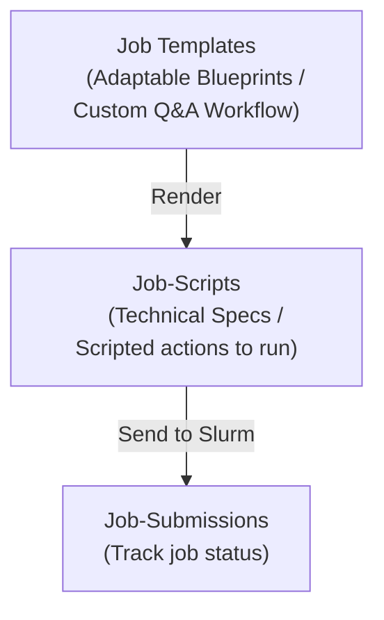

# Jobbergate Resources Overview

Jobbergate utilizes three primary resources for the efficient management of templating, job script creation, and
job submissions. These resources are maintained in distinct database tables and can be accessed via individual API endpoints
or through specific subcommands in the CLI.

As a framework, Jobbergate aims to enable application experts to create blueprint scripts in advance, containing the logic and technical specifications for both software and hardware needed to run cluster jobs.
This template system leaves placeholders that end users can fill in to customize jobs for their specific needs.

Jinja templates have been an integral part of the project since its inception (see [Attribution](../../authors.md#attribution)). Their primary uses are:

1. To insert string values into the `#SBATCH` directives, used by Slurm to manage job scheduling and resource allocation.
1. To insert string values into the script, which can be used to set variables, paths, or other configurations.
1. To manage logic with `if`, `for`, and other statements supported by Jinja.

Let's take this simple Jinja template code as an example:

```jinja
#!/bin/python3

#SBATCH --name {{ data.name }}
#SBATCH --nodes {{ data.nodes }}


print("do this")

print("do that")


work_dir = "{{ data.workdir }}"

# Remaining code (...)
```

For illustration, the following rendering variables could be provided:

```json
{
    "name": "Big-Simulation",
    "nodes": 10,
    "sample_flag": false,
    "workdir": "/home/user/folder"
}
```

And with that, the previous template can be rendered in an actual Python script:

```python
#!/bin/python3

#SBATCH --name Big-Simulation
#SBATCH --nodes 10

print("do that")

work_dir = "/home/user/folder"

# Remaining code (...)
```

The computation of rendering variables can include business logic, such as searching the file system, checking available modules, preparing supporting files, determining hardware specifications, and choosing the target templates (if the applications contains more than one). As a framework, Jobbergate enables application experts to create a Python script with a custom Question/Answer workflow that guides users through this process. This bundle of templates and application script is called a [Job Script Template](./job_script_templates.md) (also named as _Jobbergate Application_ on previous versions). The resulting [Job Script](./job_scripts.md) is ready to become a [Job Submission](./job_submissions.md) and run on the cluster for computation (from either on site or remote submissions mode). These are the three major entities on Jobbergate system, resulting in a typical workflow as follows:


