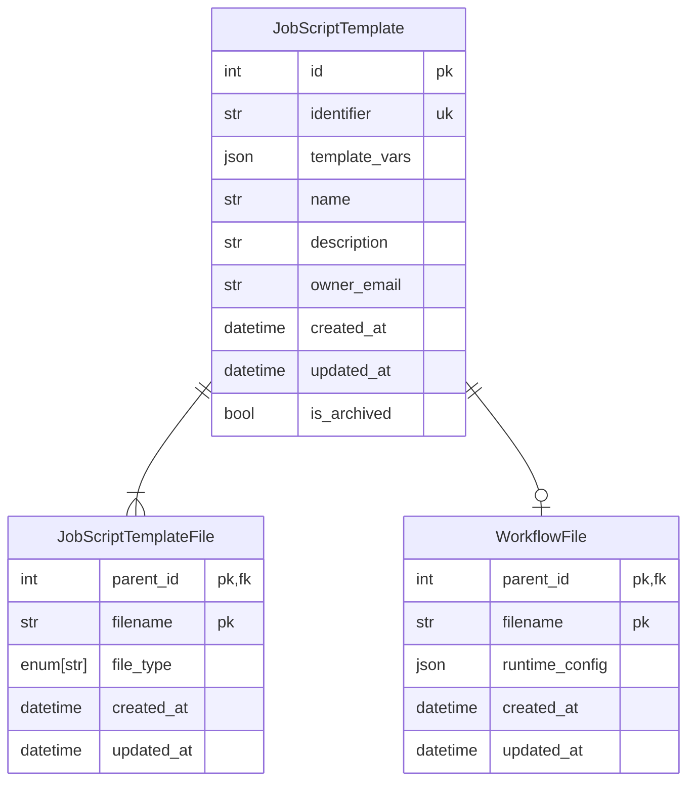

# Job Script Templates

Job Script Templates serve as adaptable blueprints for Job Scripts, allowing for the dynamic replacement of crucial
values upon rendering. The end result of this process is a Job Script primed for cluster submission.

The specific values incorporated into the template to generate a Job Script are termed "template variables." Users can
define constrains and default settings for these values within the Job Script Template's workflow script.

Additionally, Job Script Templates provide a framework that allows for the interactive collection of values from users
via the [Jobbergate CLI](../apps/cli.md).

## Data Model

