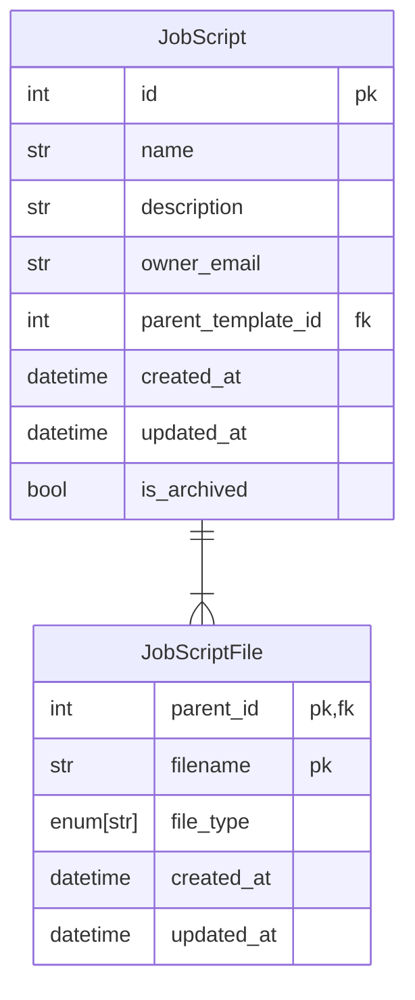

# Job Scripts

In Jobbergate, the primary resource is the Job Script. These scripts dictate the instructions for jobs intended to
execute on the Slurm cluster. They can either be Python files or shell scripts. Jobbergate facilitates the generation,
modification, and submission of these Job Scripts to the cluster.

Job Scripts can either be uploaded directly from a user's workstation or be derived by rendering the
[Job Script Templates](./job_script_templates.md).

Submission of Job Scripts to any affiliated Slurm cluster can be accomplished through the CLI, API, or Core
integrations. After submission, the execution status of a Job Script can be monitored using the
[Job Submission](./job_submissions.md) resource.

## Data Model

