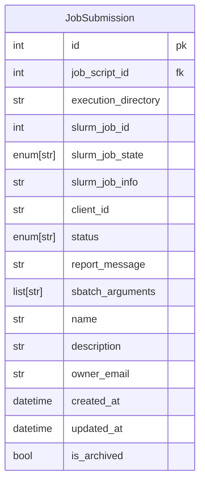

# Job Submissions

Job Submissions primarily monitor the status and metadata of a [Job Script](./job_scripts.md) dispatched by Jobbergate
to a Slurm cluster. They possess identifying details linking them to the Job Script that was submitted and to the
corresponding Job objects created by Slurm.

## Data Model

