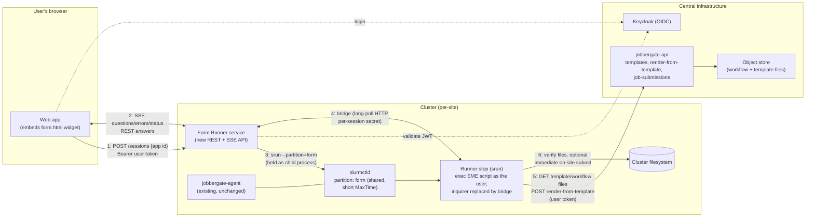
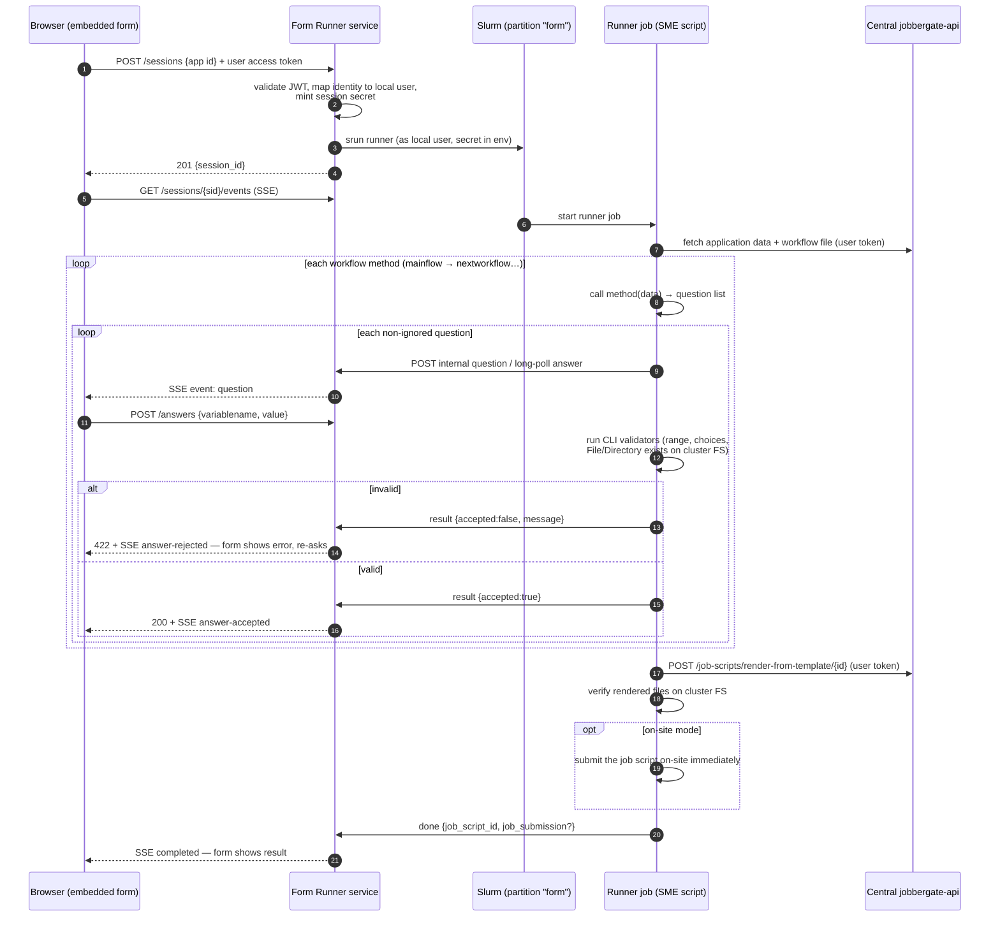

# Jobbergate Form Runner

> **Status: working proof of concept** — design and Phase-1 implementation for running
> Jobbergate application question/answer flows **on the cluster** instead of on the client,
> served as an embeddable web form. Verified end-to-end on `jobbergate-composed` (macOS/arm64):
> interview in a Slurm step, per-answer validation, render through the central API, immediate
> on-site submission, and the submitted job's output written on the cluster.

## 1. Problem

Jobbergate applications are SME-provided Python scripts (a `JobbergateApplication` class) that
interview the user to gather the render variables for the Jinja2 job-script templates. Today the
whole interview runs **client-side** in `jobbergate-cli`:

- `jobbergate job-scripts create <id-or-identifier>` downloads the workflow file and `exec`s it
  (`jobbergate_cli/subapps/applications/tools.py`, `load_application_from_source`).
- `ApplicationRuntime._gather_answers` loops over workflow methods (`mainflow` →
  `data["nextworkflow"]` chaining) and prompts with `inquirer`.
- Answers are flattened into a `param_dict` and POSTed to the existing API endpoint
  `POST /jobbergate/job-scripts/render-from-template/{id}` — the central API only renders Jinja,
  it never runs the workflow.

This is limiting because SME scripts frequently want **cluster context**: they call `squeue`,
list files (`application_helpers.get_file_list`), or validate that a `File`/`Directory` answer
exists — all of which are only meaningful **on the cluster filesystem**. Running client-side also
prevents "answer the questions, verify the inputs, and submit right away" (on-site mode).

## 2. Proposal in one paragraph

A new small REST service — the **Form Runner** — is deployed on each cluster (first target:
`jobbergate-composed`, alongside the existing agent; later, its endpoints are tunneled through the
central API). Given an application id/identifier and the user's OIDC access token, it launches a
**runner job** on a dedicated shared Slurm partition. The runner executes the same code path as
`jobbergate job-scripts create`, except `inquirer.prompt` is replaced by a **question bridge**:
each question is serialized and relayed to the service, which streams it to an embeddable web
form via **SSE**; the browser POSTs each answer back over **REST**; the runner validates it with
the very same validators the CLI uses and either accepts it or returns the validation error for
the form to display. When the interview completes, the runner renders the job script through the
existing central-API endpoint (with the user's token) and — because it is already on the cluster,
running as the user — can verify the produced files and submit them immediately (on-site mode).

## 3. Architecture



Key placement decisions:

- **The Form Runner is a separate service from the agent.** The agent is a fire-and-forget task
  poller with a client-credentials identity; the Form Runner terminates *user* requests and holds
  interactive sessions. Sharing a process would tangle those two trust models. In
  `jobbergate-composed` it becomes one more service in `docker-compose.yml`, wired to the same
  Slurm volumes (munge key, NFS mount) as the agent.
- **The SME script runs inside a Slurm job, as the local user.** This is both the feature (the
  script sees the real filesystem, `squeue`, etc.) and the sandbox: today the CLI `exec`s the SME
  script unsandboxed on the client; on the cluster, Slurm runs it under the mapped local account
  with that account's permissions and cgroup limits. The service maps the token's identity to a
  local user the same way the agent maps submissions today (`X_SLURM_USER_NAME` / sssd mapping,
  site-configurable).
- **The central API is unchanged.** The runner reuses `jobbergate-core` auth + the existing
  `render-from-template` endpoint. Only the *prompting* layer of `jobbergate-cli`'s
  `ApplicationRuntime` is swapped out.

## 4. Session protocol — REST + SSE

> *"Can it be done by REST? Or Server-Sent Events?"* — **both, split by direction.**
> Client → server is plain REST (answers are discrete, need synchronous validation results).
> Server → client is SSE (questions arrive when the SME script decides, which can take arbitrary
> time — e.g. it may scan the filesystem between questions). SSE beats WebSockets here because it
> is plain HTTP — trivially proxied/tunneled through the future central-API tunnel, works with
> `EventSource` auto-reconnect + `Last-Event-ID` replay, and we have no need for server-bound
> streaming. WebSockets remain a drop-in upgrade later if we ever need one.

### 4.1 Endpoints (public, consumed by the web form)

| Method & path | Purpose |
|---|---|
| `POST /form-runner/sessions` | Body `{"application_id_or_identifier": ...}`. Validates JWT, starts the runner step (`srun`). Returns `201 {"session_id", "status", "web_key", "form_url"}`. |
| `GET /form-runner/sessions/{sid}` | Snapshot: status, current pending question, answers so far. Used on reconnect before (re)opening the stream. |
| `GET /form-runner/sessions/{sid}/events` | SSE stream. Events: `status`, `question`, `answer-accepted`, `answer-rejected`, `completed`, `failed`. Every event carries an incrementing `id:` so `Last-Event-ID` replays anything missed. |
| `POST /form-runner/sessions/{sid}/answers` | Body `{"variablename", "value"}`. Forwarded to the runner, validated there. Returns `200 {"accepted": true}` or `422 {"accepted": false, "message": "<inquirer validation message>"}`. |
| `DELETE /form-runner/sessions/{sid}` | Cancel: terminate the held `srun` process (which cancels the step), mark session cancelled. |

### 4.2 Internal bridge (runner ↔ service)

The runner job cannot accept inbound connections (compute nodes are typically unreachable), so it
makes **outbound long-poll HTTP** to the service:

- On start, the runner reads a one-time **session secret** injected by the service into the job
  environment (or a `0600` spool file) and uses it as a bearer credential for
  `/form-runner/internal/sessions/{sid}/*`.
- `POST .../question` — publish the next question (blocks in the service until delivered to the
  event log), then `GET .../answer?wait=30s` — long-poll for the user's answer.
- `POST .../result` with `{accepted, message}` after running the local validators — this is what
  resolves the browser's pending `POST /answers` call.
- `POST .../done` with the final outcome (job script id, submission id, or error).
- A heartbeat on the long-poll keeps the session alive; if the runner goes silent past a timeout,
  the service marks the session `failed` and the form offers a restart.

If a site's compute nodes cannot reach the service at all, the same bridge can run over a shared
filesystem spool directory — the protocol is deliberately just "publish question / await answer /
publish result", so the transport is swappable.

### 4.3 Question wire format

The serializable surface of `jobbergate_cli/subapps/applications/questions.py`:

```json
{
  "type": "Integer",              // Text | Integer | List | Directory | File |
                                  // Checkbox | Confirm | BooleanList | Const
  "variablename": "ntasks",
  "message": "Number of tasks",
  "default": 4,
  "choices": null,                // List / Checkbox
  "minval": 1, "maxval": 128,     // Integer
  "exists": true                  // File / Directory
}
```

Notes from the current CLI implementation:

- The CLI **batches** questions per workflow method (`inquirer.prompt(prompts)` gets the whole
  list); we intentionally serve them **one at a time**, which the loop structure permits — the
  answers dict is simply accumulated between prompts.
- `BooleanList` children have `ignore` **callables** evaluated against accumulated answers. These
  never cross the wire: the runner evaluates them and simply skips ignored questions, exactly as
  inquirer would. Same for `Const` (auto-answered, never shown — though it is *reported* to the
  form as a read-only row for transparency).
- Validation is authoritative **only on the runner** (it reuses `Integer._validator`, choice
  membership, and — now meaningfully — `File`/`Directory` `exists` checks against the *cluster*
  filesystem). The form may mirror cheap checks (int parsing, min/max) for snappy UX, but the
  `422` from the runner is the source of truth, and its `message` is shown verbatim with a
  "try again" state.
- `fast` mode and pre-supplied params (`--param-file` equivalents) map naturally: the session
  create request can carry `{"supplied_params": {...}, "fast": true}` and the runner auto-answers
  as the CLI does today.

### 4.4 Sequence



## 5. Authentication & session ownership

- **User → service:** the embedding web app already holds an OIDC access token (same Keycloak
  realm as the API). Every REST call sends `Authorization: Bearer <token>`; the service validates
  it exactly like `jobbergate-api` does (armasec against `ARMASEC_DOMAIN`).
- **The form URL is a capability URL:** `POST /sessions` mints a short random **web key**
  alongside the session, and the returned `form_url` carries it in the **fragment**
  (`#key=...`) — short enough to share comfortably, and fragments are never sent to any
  server. The page presents it as an `X-Session-Key` header (the SSE stream is fetch-based,
  so headers work). The user's actual OIDC token never has to reach the browser form at all:
  the runner receives it directly from the service over the internal bridge.
- **Session ownership:** each session records the token's `sub` claim at creation. Every
  subsequent call — snapshot, events, answers, cancel — must present either the session's
  web key or a valid OIDC token with the **same `sub`**, otherwise `403`. This is what makes
  reconnect-after-connection-loss safe: the session id alone is never sufficient.
- **Service → runner:** the per-session one-time secret (random 256-bit) authenticates the
  internal bridge. It is minted at launch time, never logged, and invalidated when the session
  ends.
- **Runner → central API:** the runner needs the *user's* token so template fetches, the render
  call, and any SDK calls the SME script makes are attributed and authorized as the user. The
  service writes the token to a `0600` spool file readable only by the mapped local user (mirrors
  `jobbergate-core`'s `Token.save_to_cache`). Because access tokens are short-lived, the service
  should also receive token refreshes from the web app and forward them over the bridge for long
  interviews (or, later, use a token-exchange grant in Keycloak).

## 6. Slurm integration

- **Dedicated partition** (e.g. `form`): tiny resources per job (1 CPU, ~512 MB), short
  `MaxTime` (e.g. 30 min ≈ max interview length), and `OverSubscribe=FORCE` so runner jobs are
  all **shared** and never queue behind real work. Example `slurm.conf` line:

  ```
  PartitionName=form Nodes=c[1-2] Default=NO MaxTime=00:30:00 OverSubscribe=FORCE:16 PriorityTier=10
  ```

- The service starts the runner with **`srun`** (held as a child process) rather than `sbatch`:
  on the oversubscribed `form` partition the step starts immediately, so there is no queue wait
  and **no job-status polling** — the runner's exit code is observed directly by the service
  (an unexplained exit marks the session failed), and `DELETE /sessions/{sid}` simply terminates
  the `srun` process, which cancels the step. Running **as the mapped local user** gives correct
  filesystem identity for free.

## 7. Delivery phases

1. **Phase 0 — done:** design + embeddable form prototype + an in-process mock service
   ([prototype/service.py](prototype/service.py)) that runs the question loop in a thread with the
   bridge replacing `inquirer`, proving the protocol end-to-end without Slurm.
2. **Phase 1 — done (this branch):** the Form Runner is a real service
   ([jobbergate_form_runner/](jobbergate_form_runner/)) wired into `jobbergate-composed`; runner
   sessions execute via `srun` on the existing `slurmctld`/`c1`/`c2` cluster on a new shared
   `form` partition, running `jobbergate job-scripts create-web-runner` (hidden command) which
   reuses the full `create` flow with a pluggable prompt backend. See §10.
3. **Phase 2 — done with Phase 1:** the runner env sets `SBATCH_PATH`, so `--submit` uses the
   CLI's existing **on-site submission** right on the compute node.
4. **Phase 3 — future:** expose the per-cluster endpoints through the central API (reverse
   tunnel from the agent/service), so the web app talks to one origin. The REST+SSE choice keeps
   this a plain HTTP-proxying problem.

## 8. Open questions

- **Identity mapping:** exact mechanism for token `sub`/email → local Unix account per site
  (sssd, static map, or the agent's `X_SLURM_USER_NAME` convention?).
- **Token refresh** for interviews longer than the access-token TTL — forward refreshes from the
  browser vs. Keycloak token exchange for a runner-scoped token.
- **Back navigation:** the CLI loop has no "go back one question"; supporting it web-side means
  restarting the flow with previously accepted answers as `supplied_params` (cheap, since the SME
  script re-executes deterministically) — acceptable?
- **Concurrency limits:** per-user cap on live sessions; partition sizing.
- **SME script misbehavior:** wall-time is bounded by the partition `MaxTime`; do we also want
  rlimits/cgroups defaults, and a lint step at upload time?

## 9. Package layout

```
jobbergate-form-runner/
├── README.md                       ← this document
├── pyproject.toml                  ← uv workspace member
└── jobbergate_form_runner/
    ├── main.py                     ← public REST+SSE endpoints + internal bridge + form page
    ├── security.py                 ← armasec guard (mirrors jobbergate-api)
    ├── sessions.py                 ← event log + runner⇄browser synchronization
    ├── launcher.py                 ← srun/subprocess runner launch, as the mapped local user
    └── static/form.html            ← the embeddable web form (mock mode built in: open the
                                      file directly from disk to demo without any backend)
```

The initial throwaway prototype (a standalone FastAPI stub + form) was superseded by this
package and removed; the form's standalone mock mode survives in `static/form.html`.

## 10. Phase 1 implementation map (this branch)

**Service** — [jobbergate_form_runner/](jobbergate_form_runner/), a workspace member:

| Module | Role |
|---|---|
| `main.py` | Public REST+SSE endpoints (armasec-locked, owner-bound) + internal bridge (session-secret-locked) + serves `static/form.html` at `/form-runner/form` |
| `security.py` | Armasec guard mirroring `jobbergate_api.security` (same Keycloak domain, `jobbergate:job-scripts:create` scope); binds sessions to the token `sub` |
| `sessions.py` | Event log with `Last-Event-ID` replay + runner⇄browser synchronization |
| `launcher.py` | Writes the per-session runner script into the shared spool dir and starts it with `srun` as the mapped local user on the `form` partition (`subprocess` mode for dev) |

**CLI** — the runner lives in `jobbergate-cli` so the Slurm step is just a CLI invocation:

- `ApplicationRuntime` gained a pluggable prompt backend (`prompt_backend` param and the
  `active_prompt_backend` context var); the default is unchanged interactive `inquirer`.
- `subapps/applications/remote_prompt.py::BridgePrompter` serves prompts one at a time over the
  bridge and validates each answer with the original `inquirer` validators.
- `subapps/job_scripts/web_runner.py` seeds the token cache with the session owner's access
  token and calls the **unchanged** `create` command
  (`jobbergate job-scripts create <id> --submit --cluster-name <name>` semantics) under the
  bridge backend — rendering via the API and submitting on-site right away.
- New commands: `jobbergate job-scripts create-web [<id>] [--submit] [--cluster-name ...]`
  (prints the form URL, token in the `#fragment`) and the hidden `create-web-runner`.

**jobbergate-composed** — plus the macOS (Apple Silicon) fixes inspired by license-manager:

- `mysql:5.7` → `mariadb:10.11` (no arm64 image existed; this was the hard blocker).
- `platform: linux/amd64` pinned on every `Dockerfile-slurm` service (the ubuntu-hpc slurm PPA
  and gosu binary are amd64-only; they run under Rosetta).
- Fixed the agent entrypoint: `uv run --python 3.12 --no-dev --frozen --package
  jobbergate-agent jg-run` (the flags were jumbled — `--package --frozen jobbergate-agent`) and
  gave each container a private `UV_PROJECT_ENVIRONMENT` so venvs never collide with the host's
  through the `/app` bind mount.
- New `jobbergate-form-runner` service (port **8010**), `form` partition in `slurm.conf`,
  `uv` installed in `slurm-base` and the repo mounted on `c1`/`c2` so runner jobs can execute
  the CLI.

**End-to-end on composed:**

```bash
cd jobbergate-composed && docker compose up -d
# then, from the CLI container (after `jobbergate login` and uploading an application):
docker compose run --rm jobbergate-cli jobbergate job-scripts create-web <id> --submit --cluster-name local-slurm
# open the printed URL (http://localhost:8010/form-runner/form?session_id=...#token=...)
```

## 11. Self-guided tour (jobbergate-composed)

Everything below runs from `jobbergate-composed/`.

**1. Bring the stack up** (first build takes a while — it compiles nothing, but pulls a lot):

```bash
docker compose up -d
```

Wait until `docker compose ps` shows `jobbergate-api` healthy, `jobbergate-form-runner`
healthy, and the slurm containers up. Sanity checks:

```bash
docker exec slurmctld sinfo
```

should list the `compute` and the new shared `form` partitions with nodes `c[1-2]` idle, and

```bash
curl -s http://localhost:8010/form-runner/health
```

should answer `{"status":"ok"}`.

**2. Log in** (device flow against the local Keycloak). Open a shell in the CLI container
(the image's entrypoint is `jobbergate` itself, so override it for a shell):

```bash
docker compose run --rm --entrypoint bash jobbergate-cli
```

then inside it:

```bash
jobbergate login
```

Open the printed link in your browser and sign in as `local-user` / `local`. The link uses
the `keycloak.local` hostname — map it once on the host if you haven't:

```bash
echo "127.0.0.1 keycloak.local" | sudo tee -a /etc/hosts
```

**3. Upload an application** (the built-in simple example is mounted at `/simple-example`):

```bash
jobbergate applications create --name poc-web --identifier poc-web --application-path /simple-example
```

**4. Start a web session — via the CLI** (the intended UX):

```bash
jobbergate job-scripts create-web poc-web --submit --cluster-name local-slurm
```

The command starts the interview inside a Slurm step on the `form` partition and prints the
form URL (`http://localhost:8010/form-runner/form?session_id=...#token=...`). Open it in your
browser, answer the questions — invalid answers come back with the application's own
validation message — and on completion the runner renders the job script through the central
API and submits it **on-site** right away. The session id lets you reconnect to the same URL
if the connection drops.

**4b. Or start a session with curl** (what an embedding web app would do). Grab a token —
inside the CLI container `jobbergate show-token --plain`, or with the password grant:

```bash
TOKEN=$(curl -s -d 'grant_type=password&client_id=cli&username=local-user&password=local' \
  http://localhost:8080/realms/jobbergate-local/protocol/openid-connect/token | jq -r .access_token)
```

then create the session and open the form:

```bash
curl -s -X POST http://localhost:8010/form-runner/sessions \
  -H "Authorization: Bearer $TOKEN" -H 'Content-Type: application/json' \
  -d '{"application_id_or_identifier": "poc-web", "submit": true, "cluster_name": "local-slurm"}'
```

The response carries a ready-to-open `form_url` (its `#key=` fragment holds the short
per-session capability key). The same bearer drives the raw protocol too, if you want to
answer questions from the terminal:

```bash
curl -N http://localhost:8010/form-runner/sessions/<sid>/events -H "Authorization: Bearer $TOKEN"
curl -s -X POST http://localhost:8010/form-runner/sessions/<sid>/answers \
  -H "Authorization: Bearer $TOKEN" -H 'Content-Type: application/json' \
  -d '{"variablename": "workdir", "value": "/nfs"}'
```

**5. Watch it happen on the cluster side:**

```bash
docker exec slurmctld squeue                 # the jg-web-<sid> step while the interview runs
docker compose logs -f jobbergate-form-runner
cat slurm-fake-nfs/form-runner/<sid>/runner.log   # the runner's own log
```

**6. Verify the outcome** — back in the CLI container:

```bash
jobbergate job-scripts list
jobbergate job-submissions list
```

or watch the job land via `docker exec slurmctld squeue` / the agent logs.

